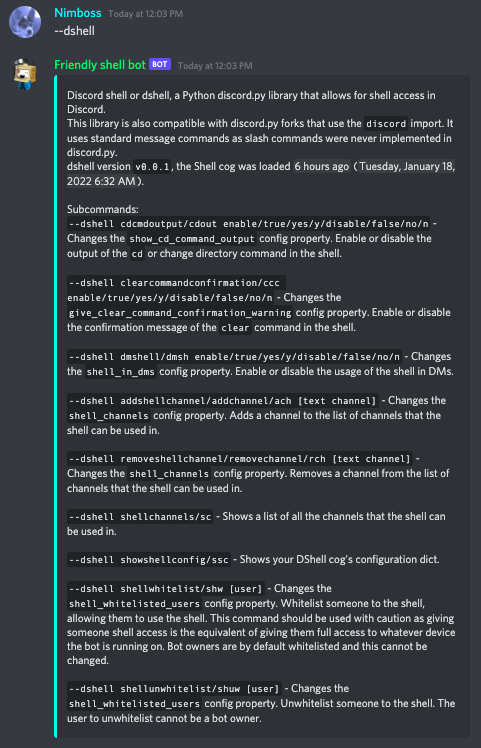

# Message commands that DShell adds to your bot

## Intro

DShell adds traditional prefixed commands to your bot.
The type of commands where you type `{your bot prefix}{command_name} {arguments}` into chat.
Since slash commands were never officially supported in discord.py, these commands are not slash commands.

In the examples below `--` will be the bot prefix. You are, of course, free to pick your own prefix/prefixes.

## Commands

`{prefix}dshell/dsh`

This is the root command for DShell. All other commands are subcommanded under it, like `{prefix}dshell/dsh {subcommand} {arguments(if any)}`

It gives you a short guide to all the DShell commands and some extra info.

## You can see all the other commands and what they do in this picture itself, no further explanation should be needed. In case the picture isn't loading or you're on a screenreader, here's the text:
 

> Discord shell or dshell, a Python discord.py library that allows for shell access in Discord.

> This library is also compatible with discord.py forks that use the `discord` import. It uses standard message commands as slash commands were never implemented in discord.py.

> dshell version `v{version number goes here, in this case 0.0.1}`, the Shell cog was loaded {a timestamp of when it was loaded, in this case <t:1642349117:R> (<t:1642349117:F>).}

> Subcommands:

> `--cdcmdoutput/cdout enable/true/yes/y/disable/false/no/n` - Changes the `show_cd_command_output` config property. Enable or disable the output of the `cd` or change directory command in the shell.

> `--clearcommandconfirmation/ccc enable/true/yes/y/disable/false/no/n` - Changes the `give_clear_command_confirmation_warning` config property. Enable or disable the confirmation message of the `clear` command in the shell.

> `--dmshell/dmsh enable/true/yes/y/disable/false/no/n` - Changes the `shell_in_dms` config property. Enable or disable the usage of the shell in DMs.

> `--addshellchannel/addchannel/ach [text channel]` - Changes the `shell_channels` config property. Adds a channel to the list of channels that the shell can be used in.

> `--removeshellchannel/removechannel/rch [text channel]` - Changes the `shell_channels` config property. Removes a channel from the list of channels that the shell can be used in.

> `--shellchannels/sc` - Shows a list of all the channels that the shell can be used in.

> `--showshellconfig/ssc` - Shows your DShell cog's configuration dict.

> `--shellwhitelist/shw [user]` - Changes the `shell_whitelisted_users` config property. Whitelist someone to the shell, allowing them to use the shell. This command should be used with caution as giving someone shell access is the equivalent of giving them full access to whatever device the bot is running on. Bot owners are by default whitelisted and this cannot be changed.

> `--shellunwhitelist/shuw [user]` - Changes the `shell_whitelisted_users` config property. Unwhitelist someone to the shell. The user to unwhitelist cannot be a bot owner.