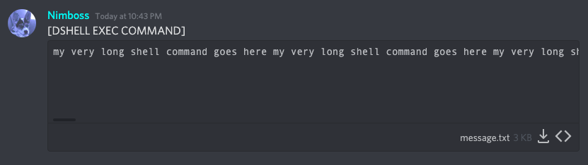

# Shell commands documentation

## Commands that behave differently from other shell commands

There are a few shell commands that behave differently from other shell commands since they don't run in the shell, but rather directly in Python. If they were to run directly in the shell, they simply wouldn't serve their purpose because of how processes work.

These commands:

### `cd`:

When you run `cd` it does not change your bot's working directory as that would probably break a lot of stuff in your bot's functioning. Instead it stores the directory and instructs the other commands to run *in* the other directory. This way nothing breaks, purpose achieved and everyone's happy.

Supported operations:

`cd ~` or `cd`: Changes the process directory to your system's home directory.

`cd ..`: Changes the process directory to the parent directory of the current process directory.

`cd directory` or `cd "directory"`: Changes the process directory to the directory specified. You do not need quotes to change to a directory with spaces, however they are supported.

### `clear`:

Running clear in a seperate new process does, well, absolutely nothing since that process is already empty. Instead the `clear` command deletes the channel (with a confirmation message if `bot.dshell_config["give_clear_command_confirmation_warning"] is True`) and creates an exactly same channel, then initializes that channel as a shell channel.

That way all your messages and commands are cleared exactly like a normal shell. Of course, it needs the Manage Channels permission for this.

## A special feature for very long shell commands

If your shell command is (somehow) longer than 2000 characters (or 4000 characters if you have nitro) then you can type `[DSHELL EXEC COMMAND]` in the shell channel along with an attachment in the same message that stores your shell command. The shell command that will be processed will be the one read from the attachment. The module only reads from the first attachment in your message.

You **can** do this with any command, its just that doing it with short commands would be rather pointless.

